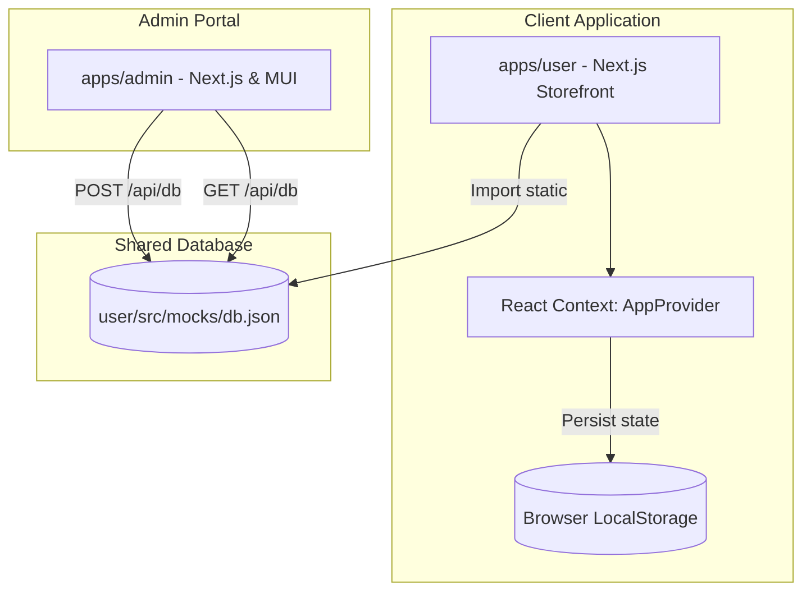

# Nakshatra Gems & Fine Jewellery

This document outlines the Product Requirement Document (PRD), Architecture Reference Document (ARD), System Architecture, and Project Scope for the Nakshatra Gems & Fine Jewellery platform.

---

## 1. Product Requirement Document (PRD)

### 1.1 Product Overview & Vision
Nakshatra Gems is an ultra-premium, luxury e-commerce platform and bespoke design workshop (atelier) specializing in GIA-certified diamonds, natural precious gemstones, and handcrafted fine jewellery. The application is divided into two main environments:
1. **Client Storefront (`apps/user`)**: A high-end, high-performance customer experience featuring elegant design elements (e.g., gold and ivory luxury gradients, animations) that allow clients to view collections, calculate real-time custom GIA diamond valuations, book private consultations, manage a personal wishlist (Jewellery Box), and place orders.
2. **Atelier Management Portal (`apps/admin`)**: A centralized dashboard built with Material-UI (MUI) that allows store owners and gemologists to configure homepage banner details, edit brand heritage timelines, adjust design collection details, view scheduler bookings, and manage product catalog inventory in real-time.

### 1.2 Target Audience
* **High-Net-Worth Individuals (HNWIs)**: Demanding certified gemstones, custom engagement bands, and exceptional digital elegance.
* **Astrology & Gemstone Enthusiasts**: Purchasing premium natural gems (e.g., Yellow Sapphire, Ruby, Aquamarine) with guaranteed origins.
* **Atelier Operations & Gemologists**: Internal staff managing customer inquiries, product inventory, and design families.

### 1.3 Core Features & Requirements
#### Client Storefront (`apps/user`)
* **Maison Showcase**: Immersive homepage featuring featured gemstones, brand timelines, customer endorsements, and curated collection portals.
* **Interactive GIA Diamond Evaluator**: Real-time valuation tool that dynamically computes estimated gemstone values based on shape, carat weight, clarity grade, and color grade (output in Indian Rupees, INR).
* **Maison Collections Hub**: Dedicated route detailing distinct design families (e.g., Royal Solitaire, Constellation, Bespoke Heritage).
* **Product Catalog & Filters**: Faceted search with filter controls for category, stone type, price, clarity, shape, and metal composition.
* **Private Consultation Scheduler**: High-security booking form enabling clients to schedule virtual or showroom-based consultations.
* **Interactive Jewellery Box (Cart / Wishlist)**: Persistent local cart and wishlist systems requiring client registration/login.
* **Secure Order & Shipping Integration**: Checkout system simulating shipping logs through standard Shiprocket status updates (Manifested -> Picked Up -> In Transit -> Out for Delivery -> Delivered).

#### Atelier Management Portal (`apps/admin`)
* **Operational Dashboard**: Executive summary charts indicating active creations, upcoming appointments, and active collections.
* **Product Catalog Manager**: Full CRUD-like interface allowing the addition of certified diamonds/jewellery and toggling inventory stock statuses.
* **Heritage Editor**: System configurations for editing brand narratives, historical milestones, and chief designer quotes.
* **Collections Hub Configurator**: Control panel to edit collection names, badges, descriptions, and visual layout classes.
* **Consultation Booking Hub**: Unified scheduling calendar showing scheduled virtual/showroom consultations and customer requests.
* **Mock Database Syncer**: Immediate local backend data synchronization via API route handlers.

---

## 2. System Architecture

The project is structured as an npm workspaces monorepo separating storefront experiences and back-office management interfaces.

### 2.1 Technical Stack
* **Monorepo Framework**: npm workspaces
* **Frontend Foundations**: Next.js v16.2.9, React v19.2.4, TypeScript v5
* **Storefront Styling**: Tailwind CSS v4 (incorporating bespoke luxury typography, gold/charcoal gradients, and glassmorphic overlays)
* **Admin Styling**: `@mui/material` & `@mui/icons-material` (v6.4.0) with `@emotion/react` & `@emotion/styled`
* **Animations**: `framer-motion` (v12) for luxury fade-ins and interactive sliders
* **Data Layer**: Local file-system mock database (`db.json`) synced via Next.js REST API routes

### 2.2 Shared Mock Database Schema
The platform relies on a local structured database located in `apps/user/src/mocks/db.json` containing:
* `announcements`: String array of promotions shown in header banner cycles.
* `hero`: Content objects (title, subtitle, description) for the storefront landing page.
* `about`: Text content driving the Brand Heritage sections.
* `collections`: Array of design families specifying descriptors, badges, and background classes.
* `products`: Product array classified into diamonds, gemstones, and finished jewelry with metadata (carat, cut, color, clarity, certificate, metal, collection, etc.).
* `bookings`: Scheduling entries detailing client name, date, time slot, appointment type (Virtual/Showroom), and coordinator notes.

---

## 3. Architecture Reference Document (ARD)

### 3.1 Key Architectural Decisions (ADRs)
1. **Context-Driven Local State Management**: The application avoids heavy Redux setups for the storefront, utilizing React Context (`AppContext.tsx`) with browser-level local storage synchronization. This satisfies instant loading and caching requirements for client sessions (cart, wishlist, profile).
2. **Direct File System API Database**: To mock a full backend without deploying external databases, `apps/admin` writes/reads updates directly to `apps/user`'s codebase JSON source through server-side `fs` write streams.
3. **MUI and Tailwind CSS Separation**: Tailwind CSS is used on the storefront for premium artistic styling flexibility, while MUI is utilized on the admin side for fast, tabular, and clean dashboard components.

### 3.2 Folder Structure & File Organization
* Root [package.json](file:///Users/user/Desktop/nakshatra-gems/package.json)
* [apps/user](file:///Users/user/Desktop/nakshatra-gems/apps/user) (Storefront App)
  * [src/app/page.tsx](file:///Users/user/Desktop/nakshatra-gems/apps/user/src/app/page.tsx) (Home Page)
  * [src/app/collections/page.tsx](file:///Users/user/Desktop/nakshatra-gems/apps/user/src/app/collections/page.tsx) (Collections)
  * [src/context/AppContext.tsx](file:///Users/user/Desktop/nakshatra-gems/apps/user/src/context/AppContext.tsx) (AppContext Provider)
  * [src/mocks/db.json](file:///Users/user/Desktop/nakshatra-gems/apps/user/src/mocks/db.json) (db.json database mock)
* [apps/admin](file:///Users/user/Desktop/nakshatra-gems/apps/admin) (Management Portal App)
  * [src/app/page.tsx](file:///Users/user/Desktop/nakshatra-gems/apps/admin/src/app/page.tsx) (Dashboard UI using MUI)
  * [src/app/api/db/route.ts](file:///Users/user/Desktop/nakshatra-gems/apps/admin/src/app/api/db/route.ts) (API Route that writes to user/src/mocks/db.json)

---

## 4. Project Scope & Roadmap

### 4.1 Phase 1: Core Platform Setup (Completed)
* [x] **Monorepo setup**: Structured routing between client applications and admin workspaces.
* [x] **Storefront Layout**: High-end landing layouts, about sections, customized navigation headers, and footers.
* [x] **Interactive Calculator**: Fully dynamic GIA valuation estimator adjusting to shapes and carats.
* [x] **Jewellery Box**: Contextual cart management system with wishlist actions, client session control, and mockup checkout routes.
* [x] **Admin Database API**: Local synchronizer modifying storefront data directly from the management panel.
* [x] **Consultation Scheduler**: Booking setup and listing screen on admin dashboard.
* [x] **Shiprocket Delivery Simulation**: Advanced tracking logs verifying package handling steps.

### 4.2 Phase 2: Production Readiness (Proposed Enhancements)
* [ ] **Database Migration**: Swap out `db.json` with a live PostgreSQL or Supabase backend.
* [ ] **Auth System**: Upgrade browser session auth to server-side authentication (e.g., Supabase Auth, NextAuth, or Auth0).
* [ ] **Real payment gateway integrations**: Connect Razorpay, Stripe, or Paytm to handle transactional flows.
* [ ] **Live Shiprocket API**: Replace simulated delivery tracking with live Shiprocket webhook tracking payloads.
* [ ] **Image uploads**: Implement cloud-based storage (e.g., AWS S3 or Cloudinary) for gemstone and product photos.
* [ ] **Admin Authentication**: Restrict access to the `/admin` portal through role-based access control (RBAC).
